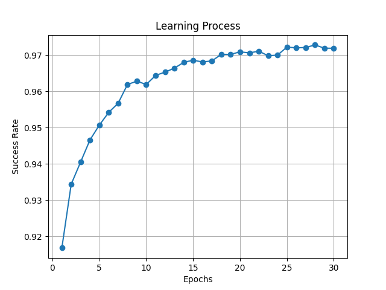

# Testausdokumentti
## Miten testata?

Automaattiset testit voi suorittaa `numnet/` -kansiosta komennolla
```bash
pytest
```
## Testikattavuus
Coveragen raportin mukaan testikattavuus on 84%. Testeistä on jätetty pois triviaalit funktiot, joten kattavuusprosentti on aivan hyvä, vaikkei olekaan 100.

## Mitä on testattu?

### Koulutus
Verkon kouluttamisen osalta on testattu, että biasit ja weightit muuttuvat kouluttaessa verkkoa. Syötteenä käytetään 10 ensimmäistä samplea koulutusdatasta ja eepokkeja on vain yksi. Lisäksi on testattu kouluttamisen overfittaamista samalla datasyötteellä, eepokkien ollessa 100. Edellä mainitut testit eivät takaa, että neuroverkko toimii oikein, mutta ainakin tiedetään, että *jotain* tapahtuu. Tämän lisäksi on testattu Forward-funktio 10 samplella, jotka ajetaan verkon läpi kaksi kertaa,
muuttaen samplejen järjestystä välissä. Tavoite on tarkistaa, että samplejen järjestys ei vaikuta outputtiin.

### Tunnistaminen
Numeroiden tunnistamisesta on testattu, että vastauksena tulee *jotakin*. Lisäksi tarkistetaan, että tulostuu ValueError, jos input-data ei ole verkon olettamassa muodossa. Automaattisen testauksen lisäksi kouluttaessa evaluate-funktio printtaa testidatan osumatarkkuuden joka eepokin jälkeen.



### Yksikkötestit
Matemaattiset funktiot Sigmoid, sen derivaatta ja mse (mean square error) derivaatta jätettiin testaamatta triviaaleina.
